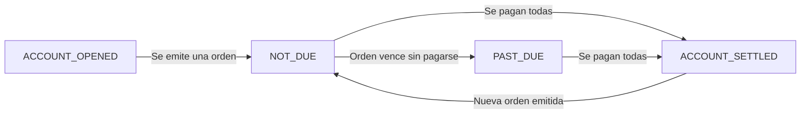

El ciclo de vida refleja la situación financiera actual de un contacto. Los estados se calculan **automáticamente** según sus órdenes — no los controlás vos, los calcula Fint.

<Info>
  Si necesitás controlar manualmente si un contacto está activo o no, usá el [Estado Activo](/developers/contact/active-status) en su lugar.
</Info>

## Estados

<CardGroup cols={2}>
  <Card title="ACCOUNT_OPENED" icon="user-plus">
    Cuenta creada, todavía no tiene ninguna orden emitida.
  </Card>

  <Card title="NOT_DUE" icon="clock">
    Tiene órdenes emitidas pero ninguna venció. Está dentro del plazo de pago.
  </Card>

  <Card title="PAST_DUE" icon="exclamation-triangle">
    Al menos una orden superó su fecha de vencimiento sin ser pagada. El contacto está en mora.
  </Card>

  <Card title="ACCOUNT_SETTLED" icon="check-circle">
    Todas las órdenes fueron pagadas. No hay saldos pendientes.
  </Card>
</CardGroup>

## Transiciones

Los cambios de estado son automáticos:

- Se **crea un contacto** → `ACCOUNT_OPENED`
- Se **emite una orden** → `NOT_DUE`
- Una orden **vence sin pagarse** → `PAST_DUE`
- Se **pagan todas** las órdenes pendientes → `ACCOUNT_SETTLED`
- Se **emite una nueva orden** → vuelve a `NOT_DUE`

<Info>
  Un contacto en `PAST_DUE` se mantiene en ese estado aunque tenga órdenes no vencidas. Basta con que **una sola** orden esté vencida sin pagar.
</Info>

## Webhook

Podés recibir notificaciones de cambios de estado configurando un webhook para el evento `contact.status`. Ver [Tipos de Eventos](/developers/webhooks/4_events).
