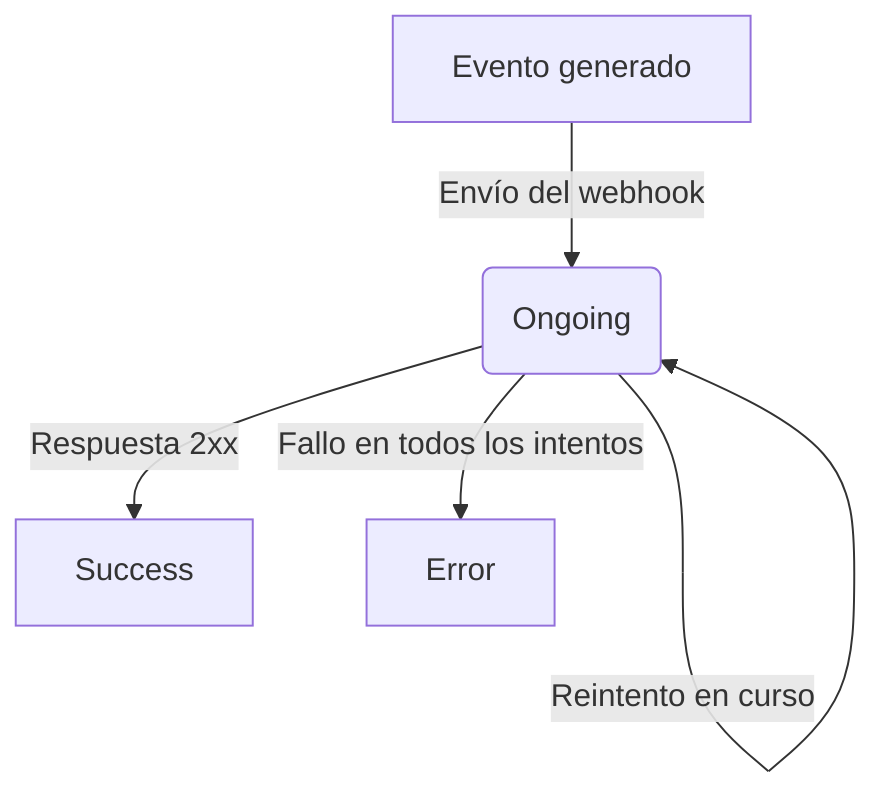

## Política de reintentos

Si Fint no recibe una respuesta 2xx de tu servidor, reintenta la entrega automáticamente con intervalos escalonados:

| Intento | Tiempo después del evento |
|---------|--------------------------|
| 1       | Inmediatamente           |
| 2       | 5 minutos                |
| 3       | 10 minutos               |
| 4       | 15 minutos               |
| 5       | 20 minutos               |
| 6       | 1 día                    |
| 7       | 2 días                   |

Después de 7 intentos fallidos, el webhook queda en estado **Error**.

<Warning>
  Tu servidor debe estar preparado para manejar **posibles duplicados**. Podés recibir el mismo evento más de una vez en caso de problemas de red o demoras en la respuesta. Usá el campo `id` del webhook para deduplicar.
</Warning>

## Sistema de logs

Cada webhook genera un log automático en Fint que registra todos los intentos de entrega. Podés consultarlos desde el panel web o por API.

El log tiene tres estados posibles:

- **ongoing**: La entrega está en proceso (incluyendo reintentos pendientes)
- **success**: El webhook se entregó exitosamente
- **error**: Todos los intentos fallaron

<Card title="API de Webhook Logs" icon="code" href="/api-reference/webhook/obtener-lista-de-registros-de-webhook">
  Consultá los logs de entrega programáticamente.
</Card>
