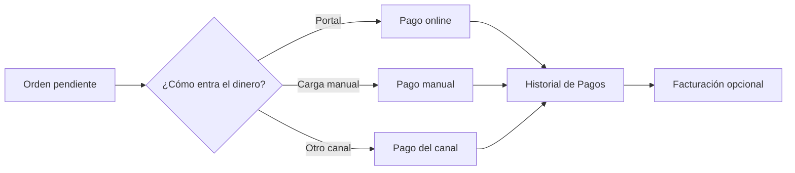

Toda cobranza termina en dos lugares: la [orden](/docs/guides/solicitudes-pago) (lo que hay que cobrar) y el [pago](/docs/guides/pagos) (lo que ya entró). Esta página te ayuda a elegir el recorrido correcto.

## Elegí cómo cobrar

<CardGroup cols={2}>
  <Card title="La familia paga sola" icon="house-user" href="/docs/guides/portal-contacto">
    Compartí el Portal de Contacto. El responsable ve las órdenes pendientes y paga online.
  </Card>
  <Card title="Registrá un cobro recibido" icon="pen" href="/docs/guides/pagos#registrar-un-pago-manual">
    Si el dinero llegó en efectivo, transferencia u otro medio fuera de Fint, cargalo sobre la orden.
  </Card>
  <Card title="Vendé por un canal público" icon="cart-shopping" href="/docs/guides/links-pago">
    Un [link de pago](/docs/guides/links-pago), una [suscripción](/docs/guides/suscripciones) o un [evento](/docs/guides/eventos) crea la orden cuando la compra se confirma.
  </Card>
  <Card title="Cobrí en el mostrador" icon="cash-register" href="/docs/guides/punto-de-venta">
    El [Punto de Venta](/docs/guides/punto-de-venta) registra la venta presencial y deja el pago en el mismo historial.
  </Card>
</CardGroup>

## Recorrido habitual

<Steps>
  <Step title="Asegurate de que exista la orden">
    Sin una orden no hay nada que imputar. Puede nacer de una liquidación, de una carga manual o de un canal de venta.
  </Step>
  <Step title="Elegí el medio de entrada">
    Si el responsable puede pagar online, enviá el [Portal](/docs/guides/portal-contacto). Si el dinero ya está en la institución, registrá el [pago manual](/docs/guides/pagos#registrar-un-pago-manual).
  </Step>
  <Step title="Confirmá el resultado">
    El cobro aparece en [Pagos](/docs/guides/pagos). La orden reduce su pendiente. Si usás ARCA, el comprobante se emite después desde [Facturación](/docs/guides/facturacion).
  </Step>
</Steps>

<Info>
  El Portal no permite saltear las facturas más antiguas. Si necesitás cobrar una orden posterior dejando otra vencida, ese caso no se resuelve eligiendo facturas en el Portal.
</Info>

## Qué no es un pago

- Una **orden** no es un cobro: es la deuda.
- Un **comprobante de ARCA** no reemplaza al pago: se emite sobre un pago ya registrado.
- Una **liquidación** prepara muchas órdenes; el dinero entra después, orden por orden.

## Seguí por acá

<CardGroup cols={3}>
  <Card title="Portal de Contacto" icon="house-user" href="/docs/guides/portal-contacto">
    Acceso, pendientes e historial para el responsable
  </Card>
  <Card title="Pagos" icon="credit-card" href="/docs/guides/pagos">
    Listado, detalle, carga manual y exportación
  </Card>
  <Card title="Órdenes" icon="file-invoice" href="/docs/guides/ordenes-gestionar">
    Dónde nace y se consulta la deuda
  </Card>
</CardGroup>
