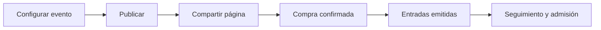

Eventos reúne la página pública, las entradas, las ventas y el control de asistentes. Usalo cuando necesites vender tipos de entrada, armar combos o validar accesos con QR.

<Info>
  Eventos es un módulo distinto de [Links de Pago](/docs/guides/links-pago). La configuración y la publicación de un evento corresponden al rol **Administrador**.
</Info>

## Cómo se organiza

<CardGroup cols={3}>
  <Card title="Crear y publicar" icon="calendar-days" href="/docs/guides/eventos-crear-publicar">
    Armá el evento, las entradas y la página pública.
  </Card>
  <Card title="Entradas, ventas y asistentes" icon="ticket" href="/docs/guides/eventos-entradas-ventas-asistentes">
    Consultá cada entrada emitida y el seguimiento de ventas.
  </Card>
  <Card title="App de Admisión" icon="mobile" href="/docs/guides/app-admision">
    El escáner QR para el día del evento.
  </Card>
</CardGroup>

El módulo tiene tres áreas en la interfaz: **Eventos**, **Asistentes** y **Estadísticas**. Cada una corresponde a un momento del trabajo.

## Conceptos que conviene distinguir

- Un **tipo de entrada** define nombre, precio, stock y si genera QR, entre otras opciones.
- Un **combo** vende varias entradas juntas con su propio nombre, precio y cantidad.
- Una **entrada emitida** pertenece a una compra y a un asistente. Puede tener QR si así se configuró su tipo.
- El **comprador** paga la orden. El **asistente** usa la entrada. Pueden ser personas distintas.

## Recorrido completo

<Steps>
  <Step title="Prepará y publicá">
    El administrador define la información del evento, los tipos de entrada, los combos, los descuentos y los datos que pedirá durante la compra.
  </Step>
  <Step title="Compartí la página">
    Cuando el evento está activo, podés copiar su enlace o abrirlo con **Visitar** para comprobar qué verá el público.
  </Step>
  <Step title="Recibí compras">
    Al presionar **Continuar**, Fint crea una sesión de compra. La confirmación posterior crea la orden y las entradas correspondientes. No es una simulación.
  </Step>
  <Step title="Seguí la operación">
    Consultá las ventas, buscá asistentes, resolvé cancelaciones y prepará la admisión.
  </Step>
</Steps>

<Info>
  **Estadísticas** está disponible para administradores. El rol **Acomodador de evento** trabaja con los eventos y asistentes que tenga asignados.
</Info>

## Estados del evento

<AccordionGroup>
  <Accordion title="Borrador">
    Conserva la configuración sin publicar la página. Usalo mientras preparás el evento.
  </Accordion>
  <Accordion title="Activo">
    Publica la página y permite compartirla con compradores. **Guardar** crea el evento en este estado.
  </Accordion>
  <Accordion title="Archivado">
    Retira el evento de la lista principal. Podés verlo con **Ver archivados** y desarchivarlo para devolverlo al estado activo.
  </Accordion>
</AccordionGroup>

## Elegí tu próxima guía

<CardGroup cols={2}>
  <Card title="Crear y publicar tu primer evento" icon="calendar-plus" href="/docs/guides/eventos-crear-publicar">
    Configurá la página, las entradas y la experiencia de compra.
  </Card>
  <Card title="Entradas, ventas y asistentes" icon="ticket" href="/docs/guides/eventos-entradas-ventas-asistentes">
    Seguí resultados, gestioná entradas y organizá la admisión.
  </Card>
</CardGroup>

## Más recursos

<CardGroup cols={3}>
  <Card title="App de Admisión" icon="mobile" href="/docs/guides/app-admision">
    Prepará al equipo que controla el ingreso.
  </Card>
  <Card title="Items y Descuentos" icon="tags" href="/docs/guides/items-descuentos">
    Conocé la configuración general de items y descuentos.
  </Card>
  <Card title="API de Eventos" icon="code" href="/api-reference/eventos/buscar-tickets-por-email-del-asistente">
    Consultá los endpoints disponibles para integraciones.
  </Card>
</CardGroup>
