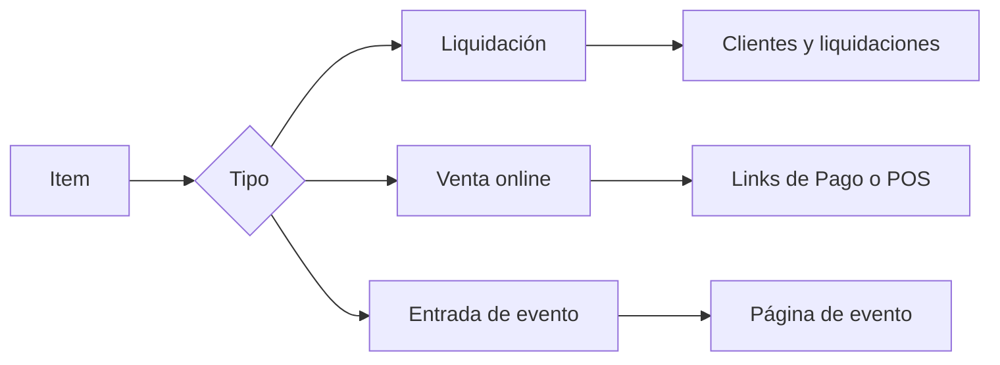

Un **item** representa algo que cobrás. Un **descuento** reduce el importe de una orden o una compra.

Antes de crearlo, definí dónde lo vas a usar. Esa elección determina su vigencia, cómo llega al comprador y qué campos vas a completar.

<Info>
  La administración de Items y Descuentos corresponde al rol **Administrador**. Las opciones visibles dependen de los módulos habilitados para tu organización.
</Info>

<Frame>
  
</Frame>

## Elegí el tipo de item

<CardGroup cols={2}>
  <Card title="Liquidación" icon="file-invoice" href="/docs/guides/items-liquidaciones">
    Usalo para cuotas, matrículas y otros conceptos que asignás a clientes antes de generar órdenes en lote.
  </Card>
  <Card title="Venta online" icon="cart-shopping" href="/docs/guides/items-venta-online-stock">
    Usalo para productos o servicios de Links de Pago y para el catálogo del Punto de Venta.
  </Card>
  <Card title="Entrada de eventos" icon="ticket" href="/docs/guides/eventos-crear-publicar#2-agregar-tipos-de-entrada">
    Usalo para entradas que después vas a incorporar a un evento. El alta incluye stock y opciones para los asistentes.
  </Card>
  <Card title="Descuentos" icon="percent" href="/docs/guides/descuentos">
    Reducciones por monto o porcentaje, según el canal: liquidación, venta online o eventos.
  </Card>
</CardGroup>

## Cómo se relacionan las piezas

El tipo se define al crear el item. Revisalo antes de guardar: al editar un item existente, la interfaz mantiene su tipo original.

## Items y descuentos son listas diferentes

En la parte superior del módulo encontrás dos pestañas:

- **Items** contiene los conceptos de cobro.
- **Descuentos** contiene reducciones de monto fijo o porcentual.

Ambas listas muestran el estado y permiten buscar por nombre. En Items también podés filtrar por tipo.

## Estados

Al crear un item o descuento, **Guardar** lo deja activo. **Guardar como borrador** conserva la configuración con estado Borrador.

Desde el menú de cada registro podés editarlo, duplicarlo, cambiar su estado o eliminarlo. Antes de modificar uno que ya usaste, revisá en qué canal está asociado.

## Vigencia

La vigencia responde dos preguntas: si el cobro ocurre una sola vez o se repite, y durante cuántos ciclos debe hacerlo.

- En **Liquidación**, también elegís el mes desde el que aplica.
- En **Venta online**, el ciclo empieza cuando la persona compra.
- Las entradas se administran dentro de la vigencia de su evento.

Consultá los ejemplos de [items para liquidaciones](/docs/guides/items-liquidaciones#configurar-la-vigencia) o de [venta online](/docs/guides/items-venta-online-stock#elegir-la-vigencia).

## Crear un item de Venta online

Elegí este tipo para publicar un producto o servicio en un Link de Pago, o para incorporarlo a un Punto de Venta.

El Punto de Venta admite items de Venta online con **pago único**. Encontrás el alta completa y la gestión de existencias en [Venta online y stock](/docs/guides/items-venta-online-stock).

## Descuentos

Un descuento puede corresponder a Liquidación, Venta online o Eventos. El canal define si se asigna a clientes, se aplica en el POS o funciona como código en un evento.

Antes de crearlo, revisá alcance, vigencia y condiciones en la [guía de Descuentos](/docs/guides/descuentos).

## Importar desde Excel

Usá **Importar Excel** para altas masivas y descargá siempre el modelo actual desde el modal. El importador acepta archivos `.xlsx`. Reconoce las columnas por el **nombre del encabezado**, no por la posición.

| Columna | Requerido | Valores que acepta |
| --- | --- | --- |
| **Nombre** | Sí | El nombre del item. |
| **Canal** | Sí | `Liquidacion`, `Venta online` o `Evento`. |
| **Monto** | Sí | Precio. Acepta coma o punto. **Negativo** = descuento, y solo vale en Liquidación. |
| **Descripcion** | No | Texto corto. |
| **Estado** | No | `Activo` (default) o `Borrador`. |
| **FechaInicio** | En liquidación, sí | Queda el día 1 de ese mes. |
| **Frecuencia** | No | `Unica`, `Mensual` o `Anual`. Venta online y Evento importados salen siempre de pago único. |
| **Cuotas** | En liquidación, sí | Cantidad de ciclos. El formulario corta en 24; el Excel no. No hay columna de indefinido. |
| **StockInicial** | No | Solo Evento o Venta online. En liquidación se ignora. |

La plantilla **no** importa descuentos, imágenes, clientes asignados, mora, combos ni códigos de cupón. Completá eso después, item por item.

<Warning>
  Un descuento no se da de alta por esta planilla. Revisá canal, estado, vigencia y stock de cada item importado antes de liquidar o publicarlo.
</Warning>

## Próximos pasos

<CardGroup cols={2}>
  <Card title="Items para liquidaciones" icon="layer-group" href="/docs/guides/items-liquidaciones">
    Prepará cuotas, matrículas y asignaciones a clientes.
  </Card>
  <Card title="Venta online y stock" icon="boxes-stacked" href="/docs/guides/items-venta-online-stock">
    Configurá productos para Links de Pago y Punto de Venta.
  </Card>
  <Card title="Descuentos" icon="percent" href="/docs/guides/descuentos">
    Definí el valor, el alcance y el canal de cada beneficio.
  </Card>
  <Card title="Eventos" icon="calendar-days" href="/docs/guides/eventos">
    Creá entradas y publicalas en una página de evento.
  </Card>
</CardGroup>
