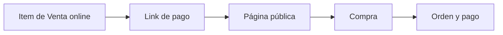

Un **link de pago** es una página pública. La compartís y la persona elige qué comprar. No hace falta que esa persona ya exista como cliente en Fint.

Sirve para un taller, un producto de la tienda o un servicio extra. No reemplaza a las [cuotas institucionales](/docs/guides/solicitudes-pago): esas las generás vos. Acá se inscribe quien quiere.

<Info>
  Antes de armar el link, creá los artículos como items de **Venta online** en [Items](/docs/guides/items-venta-online-stock). El link no crea el producto: solo lo ofrece.
</Info>

## Cómo se organiza

<CardGroup cols={3}>
  <Card title="Crear" icon="plus">
    Definí el nombre interno, el título visible, la descripción, la dirección web y los artículos.
  </Card>
  <Card title="Publicar" icon="globe">
    **Guardar** deja el link **Activo**. **Guardar como borrador** lo guarda sin publicarlo.
  </Card>
  <Card title="Compartir" icon="share">
    Desde el listado podés **Visitar**, **Editar**, **Duplicar** o **Eliminar**.
  </Card>
</CardGroup>

## Recorrido

<Steps>
  <Step title="Prepará los artículos">
    Usá items de Venta online. Pueden ser de pago único o recurrentes. Un item recurrente, al comprarse, inicia una [suscripción](/docs/guides/suscripciones).
  </Step>
  <Step title="Creá el link">
    En **Links de pago**, usá **+ Crear link de pago**. Completá cómo se ve la página y qué artículos ofrece.
  </Step>
  <Step title="Publicá y compartí">
    Cuando esté **Activo**, copiá la dirección o usá **Visitar** para ver lo mismo que ve el comprador. La dirección compartible es la de tu institución más la **dirección web** que definiste, por ejemplo `tuinstitucion.fint.app/tienda-uniforme`.
  </Step>
</Steps>

## Crear el link

El formulario tiene el contenido a la izquierda y una **vista previa** a la derecha.

<Frame>
  
</Frame>

<Steps>
  <Step title="General">
    El **nombre de la página** es interno: aparece en tu listado, no en la página pública. La **fecha de expiración** es opcional. Si la cargás, tiene que ser posterior a hoy; cuando esa fecha pasa, la página deja de aceptar compras.
  </Step>
  <Step title="Personalización">
    El **título** es lo que ve el comprador. La **descripción** admite formato y muestra un contador de 264 caracteres. La **imagen de portada** recomienda 1200 × 630. La **dirección web** completa la URL de tu institución, por ejemplo `tuinstitucion.fint.app/curso-robotica`.
  </Step>
  <Step title="Artículos y etiquetas">
    Con **+ Agregar artículo** elegís items de Venta online. Podés sumar más de uno. En el formulario actual, el comprador elige un artículo al pagar.

    Si asignás **etiquetas**, Fint se las pone al **cliente** que se crea con la compra. El responsable de pago no las hereda.

    <Frame>
      
    </Frame>
  </Step>
  <Step title="Cobro, si tu procesador lo permite">
    La sección **Cobro** aparece cuando la organización usa **Stripe** o **Mercado Pago**. El interruptor **Debitar automáticamente todos los meses** intenta el débito solo. Sin débito automático, cada ciclo genera su [orden](/docs/guides/solicitudes-pago) y la persona la paga desde el portal.

    <Warning>
      En Mercado Pago el débito **no funciona** si el item es de vigencia **indefinida**. El checkout dice «En este momento no es posible efectuar el pago». Usá N ciclos, o apagá el débito y enviá factura. Pagos360 y Nuvei tampoco debitan.
    </Warning>
  </Step>
  <Step title="Facturación">
    **Día fijo de emisión** hace que las facturas de una suscripción salgan el mismo día de cada mes, sin importar cuándo se inscribió la persona. **Días hasta el vencimiento** cuenta desde esa emisión. Si lo dejás vacío, Fint usa **10 días**. No es la [mora](/docs/guides/configuracion-mora): es la fecha de vencimiento de cada orden del ciclo.
  </Step>
  <Step title="Confirmación">
    **Agregar texto al finalizar el proceso** muestra un mensaje extra en la página cuando el pago termina. Sirve para una indicación o un próximo paso.

    **Agregar texto al email de confirmación de pago** suma ese mensaje al mail que recibe el comprador cuando se acredita el pago. Si lo activás, el texto tiene que tener al menos 20 caracteres.

    <Frame>
      
    </Frame>
  </Step>
  <Step title="Guardá">
    **Guardar** publica el link como **Activo**. **Guardar como borrador** lo deja guardado sin publicarlo. En un link ya creado, el menú de estado permite pasar de **Activo** a **Borrador** o al revés.
  </Step>
</Steps>

<Warning>
  El recuadro de descripción dice “opcional”, pero al guardar Fint pide un texto de al menos tres caracteres. Completalo antes de publicar.
</Warning>

## Listado y estados

El listado muestra el nombre interno, el título, la fecha de expiración y el estado.

<Frame>
  
</Frame>

<CardGroup cols={2}>
  <Card title="Activa" icon="circle-check">
    La página está publicada y puede recibir compras.
  </Card>
  <Card title="Borrador" icon="pen">
    El link está guardado y todavía no se ofrece al público.
  </Card>
</CardGroup>

En cada fila, el menú permite **Visitar**, **Editar**, **Duplicar página** o **Eliminar**. Al eliminar, Fint avisa que ya no vas a recibir nuevas suscripciones en esa página.

## Cómo se ve la página pública

**Visitar** abre la misma página que ve quien recibe el link. No pide usuario de Fint. En Colegio Modelo, la tienda del uniforme muestra el título, la descripción y los artículos con su precio.

<Frame>
  
</Frame>

Desde el teléfono se ve igual de simple:

<Frame>
  
</Frame>

El comprador elige un artículo y pulsa **Continuar**. Ahí empieza el checkout: se identifican sus datos y se cobra. Esta guía no recorre ese cobro.

Si el link está vencido, la página pública dice **Link de pago expirado**. No se puede comprar. La fecha corta a las **23:59** de ese día. Si no hay fecha, no vence. Pasar el link a **Borrador** deja de publicarlo.

## Qué pasa cuando alguien compra

Después de **Continuar**, la persona completa sus datos de contacto y paga con el método disponible según el procesador de la organización (tarjeta, transferencia o cupón offline, según el caso). Con eso:

1. Se crea o se reconoce a la persona como cliente.
2. Se genera una [orden](/docs/guides/solicitudes-pago) y, si el cobro se confirma, un [pago](/docs/guides/pagos).
3. Si el artículo era recurrente, también queda una [suscripción](/docs/guides/suscripciones).

Esta guía no recorre el checkout con procesador real. Si eligieron **transferencia** o un **cupón offline**, sí se puede mostrar el mail que reciben para terminar el pago:

### El email con la información de la compra

Cuando el pago se acredita, el comprador recibe el mail de confirmación de siempre. Si configuraste textos, le llega **además** un email aparte, **Información de tu compra**, con la portada del link, el detalle del pago y dos bloques:

- **Información General**: el texto del email que definiste en la sección **Confirmación** del link.
- **Indicaciones**: el texto extra de cada artículo comprado. Se configura en el editor del item de Venta online, con **Incluir texto en el email de confirmación de pago**.

## Casos de uso

Algunas formas típicas de combinar las piezas de esta guía. Cada caso indica qué configurar y qué recibe el comprador.

<AccordionGroup>
  <Accordion title="Vender cursos por video, con el acceso en el email">
    Una profesora vende cursos grabados. Cada curso tiene su propio video.

    1. Creá un item de **Venta online** de pago único por cada curso.
    2. En cada item, activá **Incluir texto en el email de confirmación de pago** y pegá el **link del video** con las instrucciones de acceso. El editor admite enlaces y formato.
    3. Creá el link de pago con todos los cursos como artículos. En **Confirmación**, usá el texto del email para lo común a todos: soporte, vigencia del acceso, cómo pedir ayuda.

    Cuando alguien compra un curso y el pago se acredita, recibe el email **Información de tu compra** con el bloque de **su** curso: el link del video y las instrucciones. No hace falta mandar nada a mano.

    <Frame>
      
    </Frame>
  </Accordion>
  <Accordion title="Tienda de productos con retiro en el colegio">
    La tienda del uniforme de esta guía: buzo y remera como items de pago único.

    En el link, el texto del email de **Confirmación** dice dónde y cuándo se retira el pedido («en secretaría de 9 a 13 hs»). Si un producto necesita una aclaración propia (por ejemplo, confirmar el talle), va en el texto del item.

    El comprador paga online y le llega el email con las instrucciones de retiro, sin que nadie lo persiga. Es el email que se ve más arriba, en [el email con la información de la compra](#el-email-con-la-informaci%C3%B3n-de-la-compra).
  </Accordion>
  <Accordion title="Taller mensual con inscripción abierta">
    Un taller que se cobra todos los meses: un item **recurrente** con N ciclos de cobro.

    Al comprar, queda creada una [suscripción](/docs/guides/suscripciones). En **Facturación**, el **día fijo de emisión** hace que todas las órdenes del taller salgan el mismo día del mes, se haya inscripto cuando se haya inscripto la persona. Si la organización usa Stripe o Mercado Pago, podés activar el débito automático; si no, cada ciclo genera su orden y la persona paga desde el portal.

    En el texto del email conviene poner cuándo empieza la actividad y a quién escribir.

    <Frame>
      
    </Frame>
  </Accordion>
  <Accordion title="Inscripción con fecha límite">
    Una inscripción que cierra un día concreto: cargá la **fecha de expiración** en General.

    Hasta esa fecha, la página acepta compras; después muestra **Link de pago expirado** (corta a las 23:59). El texto **al finalizar el proceso** de Confirmación sirve para el próximo paso inmediato («te esperamos el lunes 9 con este comprobante»), y el texto del **email** para lo que conviene que quede por escrito.

    Si necesitás cerrarla antes, pasá el link a **Borrador** desde el listado.

    <Frame>
      
    </Frame>
  </Accordion>
</AccordionGroup>

## Próximos pasos

<CardGroup cols={3}>
  <Card title="Venta online" icon="tags" href="/docs/guides/items-venta-online-stock">
    Creá los artículos que el link va a ofrecer
  </Card>
  <Card title="Suscripciones" icon="repeat" href="/docs/guides/suscripciones">
    Seguimiento cuando el item es recurrente
  </Card>
  <Card title="Pagos" icon="credit-card" href="/docs/guides/pagos">
    Dónde aparece el cobro después de la compra
  </Card>
</CardGroup>
