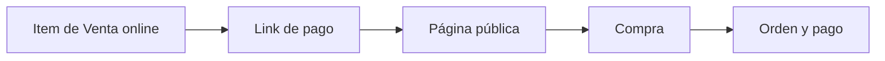

Un **link de pago** es una página pública. La compartís y la persona elige qué comprar. No hace falta que esa persona ya exista como cliente en Fint.

Sirve para un taller, un producto de la tienda o un servicio extra. No reemplaza a las [cuotas institucionales](/docs/guides/solicitudes-pago): esas las generás vos. Acá se inscribe quien quiere.

<Info>
  Antes de armar el link, creá los artículos como items de **Venta online** en [Items](/docs/guides/items-venta-online-stock). El link no crea el producto: solo lo ofrece.
</Info>

## Cómo se organiza

<CardGroup cols={3}>
  <Card title="Crear" icon="plus">
    Definí el nombre interno, el título visible, la descripción, la dirección web y los artículos.
  </Card>
  <Card title="Publicar" icon="globe">
    **Guardar** deja el link **Activo**. **Guardar como borrador** lo guarda sin publicarlo.
  </Card>
  <Card title="Compartir" icon="share">
    Desde el listado podés **Visitar**, **Editar**, **Duplicar** o **Eliminar**.
  </Card>
</CardGroup>

## Recorrido

<Steps>
  <Step title="Prepará los artículos">
    Usá items de Venta online. Pueden ser de pago único o recurrentes. Un item recurrente, al comprarse, inicia una [suscripción](/docs/guides/suscripciones).
  </Step>
  <Step title="Creá el link">
    En **Links de pago**, usá **+ Crear link de pago**. Completá cómo se ve la página y qué artículos ofrece.
  </Step>
  <Step title="Publicá y compartí">
    Cuando esté **Activo**, copiá la dirección o usá **Visitar** para ver lo mismo que ve el comprador.
  </Step>
</Steps>

## Crear el link

El formulario tiene el contenido a la izquierda y una **vista previa** a la derecha.

<Frame>
  
</Frame>

<Steps>
  <Step title="General">
    El **nombre de la página** es interno: aparece en tu listado, no en la página pública. La **fecha de expiración** es opcional. Si la cargás, tiene que ser posterior a hoy.
  </Step>
  <Step title="Personalización">
    El **título** es lo que ve el comprador. La **descripción** admite formato y muestra un contador de 264 caracteres. La **imagen de portada** recomienda 1200 × 630. La **dirección web** completa la URL de tu institución, por ejemplo `tuinstitucion.fint.app/curso-robotica`.
  </Step>
  <Step title="Artículos y etiquetas">
    Con **+ Agregar artículo** elegís items de Venta online. Podés sumar más de uno. En el formulario actual, el comprador elige un artículo al pagar.

    Si asignás **etiquetas**, Fint se las pone al cliente y al contacto que se crean cuando alguien compra.

    <Frame>
      
    </Frame>
  </Step>
  <Step title="Cobro, si tu procesador lo permite">
    La sección **Cobro** aparece cuando la organización usa **Stripe** o **Mercado Pago**. El interruptor **Debitar automáticamente todos los meses** cambia el recaudo de las suscripciones: o se intenta el débito solo, o se envía una factura en cada período.
  </Step>
  <Step title="Facturación, si hay recurrencia">
    **Día fijo de emisión** hace que las facturas de una suscripción salgan el mismo día de cada mes, sin importar cuándo se inscribió la persona. **Días hasta el vencimiento** cuenta desde esa emisión.
  </Step>
  <Step title="Confirmación">
    **Agregar texto al finalizar el proceso** muestra un mensaje extra cuando el pago termina. Sirve para una indicación o un próximo paso.
  </Step>
  <Step title="Guardá">
    **Guardar** publica el link como **Activo**. **Guardar como borrador** lo deja guardado sin publicarlo. En un link ya creado, el menú de estado permite pasar de **Activo** a **Borrador** o al revés.
  </Step>
</Steps>

<Warning>
  El recuadro de descripción dice “opcional”, pero al guardar Fint pide un texto de al menos tres caracteres. Completalo antes de publicar.
</Warning>

## Listado y estados

El listado muestra el nombre interno, el título, la fecha de expiración y el estado.

<Frame>
  
</Frame>

<CardGroup cols={2}>
  <Card title="Activa" icon="circle-check">
    La página está publicada y puede recibir compras.
  </Card>
  <Card title="Borrador" icon="pen">
    El link está guardado y todavía no se ofrece al público.
  </Card>
</CardGroup>

En cada fila, el menú permite **Visitar**, **Editar**, **Duplicar página** o **Eliminar**. Al eliminar, Fint avisa que ya no vas a recibir nuevas suscripciones en esa página.

## Cómo se ve la página pública

**Visitar** abre la misma página que ve quien recibe el link. No pide usuario de Fint. En Colegio Modelo, la tienda del uniforme muestra el título, la descripción y los artículos con su precio.

<Frame>
  
</Frame>

El comprador elige un artículo y pulsa **Continuar**. Ahí empieza el checkout: se identifican sus datos y se cobra. Esta guía no recorre ese cobro.

## Qué pasa cuando alguien compra

1. Se crea o se reconoce a la persona como cliente.
2. Se genera una [orden](/docs/guides/solicitudes-pago) y, si el cobro se confirma, un [pago](/docs/guides/pagos).
3. Si el artículo era recurrente, también queda una [suscripción](/docs/guides/suscripciones).

Esta guía no recorre el checkout hasta el final. El cobro queda para cuando se pueda probar en local sin dejar residuos.

## Próximos pasos

<CardGroup cols={3}>
  <Card title="Venta online" icon="tags" href="/docs/guides/items-venta-online-stock">
    Creá los artículos que el link va a ofrecer
  </Card>
  <Card title="Suscripciones" icon="repeat" href="/docs/guides/suscripciones">
    Seguimiento cuando el item es recurrente
  </Card>
  <Card title="Pagos" icon="credit-card" href="/docs/guides/pagos">
    Dónde aparece el cobro después de la compra
  </Card>
</CardGroup>
