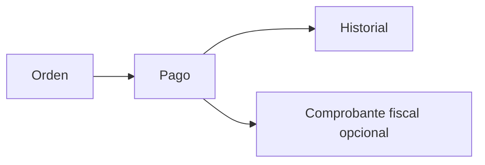

Pagos es el historial de lo que ya entró. Una [orden](/docs/guides/solicitudes-pago) registra lo que hay que cobrar; un pago registra el cobro, ya sea online o cargado a mano.

<Info>
  Esta guía describe la vista **Administrador**. Registrar, eliminar y exportar son acciones administrativas.
</Info>

## Cómo se organiza

<CardGroup cols={3}>
  <Card title="Listado" icon="list">
    Buscá por cliente, concepto o referencia y filtrá por medio, origen, quién lo registró o etiquetas.
  </Card>
  <Card title="Detalle" icon="receipt">
    Abrí un pago para ver importe, medio, estado, quién pagó y las órdenes cubiertas.
  </Card>
  <Card title="Exportar" icon="file-export">
    Descargá Excel o PDF eligiendo un rango y si filtrás por la fecha del cobro o por la de registro.
  </Card>
</CardGroup>

El comprobante fiscal no nace con el pago. Si tu organización usa ARCA, se gestiona después desde [Facturación](/docs/guides/facturacion).

## Listado

El listado muestra cliente, fecha, concepto, medio de pago, importe y estado. Los pagos cargados a mano se distinguen con **(M)** junto al medio.

El buscador recorre el nombre del cliente, el concepto, la descripción y la referencia del pago.

También podés filtrar por:

- **Medio de pago**
- **Origen**: Manual u Online
- **Registrado por**, cuando el pago es manual
- **Etiquetas** del cliente

### Estados

<CardGroup cols={3}>
  <Card title="Exitoso" icon="check-circle">
    El pago quedó acreditado. Es el estado habitual de un cobro confirmado.
  </Card>
  <Card title="Reembolsado" icon="rotate-left">
    El procesador devolvió el pago y Fint lo refleja como VOIDED.
  </Card>
  <Card title="Contracargo" icon="exclamation-triangle">
    El pagador desconoció el cobro ante su tarjeta.
  </Card>
</CardGroup>

## Detalle del pago

Al hacer clic en una fila se abre el detalle. La información cambia según el origen:

<Tabs>
  <Tab title="Pago manual">
    Muestra la fecha del cobro, la fecha en que se registró en Fint, el importe, el medio con la marca Manual, el estado, quién lo registró, quién pagó y el cliente asociado.

    También lista las **órdenes de pago** cubiertas, con el importe imputado a cada una.

    

    Si el pago se cargó por error, usá **Eliminar pago manual**. Eso revierte el cobro y vuelve a dejar pendiente lo imputado a las órdenes.

    <Warning>
      Solo se pueden eliminar pagos **manuales**. Si el pago ya tiene comprobantes emitidos, Fint bloquea la eliminación.
    </Warning>
  </Tab>

  <Tab title="Pago online">
    Muestra la fecha de procesamiento, el importe, el medio, el estado, la referencia del procesador, quién pagó y el cliente asociado.

    También lista las órdenes cubiertas.

    <Info>
      Los pagos online no se eliminan desde Fint. El estado cambia cuando el procesador informa un reembolso o un contracargo.
    </Info>
  </Tab>
</Tabs>

## Registrar un pago manual

Usalo para un cobro en efectivo, transferencia u otro medio que no pasó por el checkout online.

<Steps>
  <Step title="Abrí la orden">
    Entrá desde [Órdenes](/docs/guides/ordenes-gestionar) o desde el perfil del cliente.
  </Step>
  <Step title="Cargá el cobro">
    En la sección **Pagos** del detalle, usá **+**. Completá medio, fecha y monto. El monto viene precargado con el total pendiente, mora incluida, y podés bajarlo para un **pago parcial**. También elegís qué contacto realizó el pago.

    
  </Step>
  <Step title="Confirmá">
    El pago aparece en el historial y la orden actualiza su pendiente.
  </Step>
</Steps>

<Info>
  En un pago parcial, el dinero cubre primero el capital. La mora recién se cobra cuando el capital queda cubierto. Si la orden ya estaba vencida, Fint congela la mora acumulada en ese momento para que no siga corriendo sobre lo ya pagado.
</Info>

## Devoluciones y contracargos

Las devoluciones se gestionan en el **procesador** (Mercado Pago, Stripe, Pagos Online u otro conectado). Fint escucha esos eventos y actualiza el pago:

- **Reembolso**: el pago pasa a Reembolsado.
- **Contracargo**: el pago pasa a Contracargo.

No hay una acción de reembolso dentro del módulo Pagos.

## Exportar

**Exportar** abre un modal para elegir el rango **Desde / Hasta** y el tipo de fecha:

- **En la que se ejecutó el pago**: la fecha real del cobro
- **En la que se creó el pago**: la fecha de registro en Fint

Podés descargar **Excel** o **PDF**.

<Info>
  En un pago manual, la fecha de ejecución puede ser distinta de la de registro. Por ejemplo, recibiste el dinero el 1 de marzo y lo cargaste el 5.
</Info>

La exportación usa ese rango y, si llegaste al listado desde un evento, también respeta ese recorte. No copia los filtros de medio, origen o etiquetas que tengas activos en la tabla.

## Próximos pasos

<CardGroup cols={3}>
  <Card title="Órdenes" icon="file-invoice" href="/docs/guides/ordenes-gestionar">
    Revisá deudas y registrá el cobro desde la orden
  </Card>
  <Card title="Portal de Contacto" icon="house-user" href="/docs/guides/portal-contacto">
    Cómo pagan las familias sin que vos cargues el cobro
  </Card>
  <Card title="Facturación" icon="file-lines" href="/docs/guides/facturacion">
    Emití el comprobante fiscal sobre el pago
  </Card>
</CardGroup>
