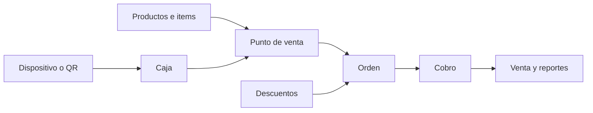

El módulo **Punto de Venta** reúne el catálogo, el stock, los clientes y los pagos de tus ventas presenciales. Podés cobrar en efectivo, por transferencia o con varios medios en una misma venta. En organizaciones de Argentina, también podés usar Point y QR de Mercado Pago.

<Frame>
  
</Frame>

## Cómo se organiza

<CardGroup cols={3}>
  <Card title="Punto de venta" icon="store">
    Es el espacio de trabajo del cajero. Define qué productos puede vender, cómo se agrupan y qué configuración usa.
  </Card>
  <Card title="Caja" icon="cash-register">
    Vincula el punto de venta con Point y QR. Puede tener un dispositivo, un QR o ambos.
  </Card>
  <Card title="Dispositivo" icon="mobile-screen-button">
    Es la terminal física sincronizada con Mercado Pago. Para recibir cobros desde Fint debe estar asignada a una caja y en modo **PDV**.
  </Card>
</CardGroup>

<Info>
  Los administradores crean puntos de venta y administran productos, grupos, cajas y reportes.

  Al invitar o editar un **Cajero**, definen sus puntos de venta, cajas y visibilidad sobre ventas de otros cajeros. En cada POS permitido, el cajero opera desde **Inicio** y **Ventas**.

  Consultá [Miembros y roles](/docs/guides/miembros-y-roles) para configurar ese acceso.
</Info>

## Preparación inicial

Configurá estos elementos en este orden:

1. **Productos:** [creá items de tipo **Venta online**](/docs/guides/items-descuentos#crear-un-item-de-venta-online), con pago único y stock disponible.
2. **Integración:** si vas a cobrar con Point o QR, [conectá Mercado Pago](/docs/guides/conectar-mercado-pago).
3. **Punto de venta:** entrá a **Punto de Venta → Puntos de venta**, presioná **Crear** y usá un nombre claro, como “Tienda escolar”.
4. **Caja:** creá o asociá una caja, vinculala al punto de venta y, si corresponde, asignale el dispositivo.
5. **Equipo:** [creá o editá un miembro con rol **Cajero**](/docs/guides/miembros-y-roles#configurar-un-cajero-para-punto-de-venta) y definí qué puntos de venta, cajas y ventas puede consultar.

<Frame>
  
</Frame>

## Flujo de trabajo

<Steps>
  <Step title="Prepará el catálogo y la caja">
    [Agregá productos y grupos](/docs/guides/pos-configuracion). Después [asociá la caja y, si corresponde, el dispositivo](/docs/guides/pos-cajas-dispositivos).
  </Step>
  <Step title="Dale acceso al equipo">
    [Invitá a los cajeros y limitá sus puntos de venta, cajas y visibilidad de ventas](/docs/guides/miembros-y-roles#configurar-un-cajero-para-punto-de-venta).
  </Step>
  <Step title="Armá una orden">
    [Seleccioná al cliente, agregá productos o un item de monto libre y revisá las cantidades](/docs/guides/pos-venta).
  </Step>
  <Step title="Aplicá los descuentos">
    [Combiná descuentos guardados y manuales con alcance global o por producto](/docs/guides/pos-descuentos).
  </Step>
  <Step title="Cobrá y revisá el resultado">
    [Elegí el medio y resolvé excepciones](/docs/guides/pos-cobros). Luego [consultá la venta o los reportes](/docs/guides/pos-ventas-reportes).
  </Step>
</Steps>

## Límites importantes

- El catálogo del POS acepta items de tipo **Venta online**, con vigencia de **pago único**.
- La interfaz del POS exige que la orden alcance un mínimo de **30 unidades de la moneda de la organización** para pasar al cobro.
- Los descuentos guardados del POS deben ser de tipo **Venta online**, estar activos y tener stock disponible.
- Point y QR están disponibles para organizaciones de **Argentina** y aparecen como medios de pago solo si la caja elegida está lista para ese canal.
- La caja elegida queda guardada en el navegador de ese dispositivo. Elegirla en una computadora no cambia la selección de otra.

## Próximos pasos

<CardGroup cols={3}>
  <Card title="Configuración" icon="sliders" href="/docs/guides/pos-configuracion">
    Catálogo, grupos y compra anónima
  </Card>
  <Card title="Cajas y dispositivos" icon="cash-register" href="/docs/guides/pos-cajas-dispositivos">
    Prepará Point y QR
  </Card>
  <Card title="Hacer una venta" icon="cart-shopping" href="/docs/guides/pos-venta">
    Operación diaria del cajero
  </Card>
</CardGroup>
