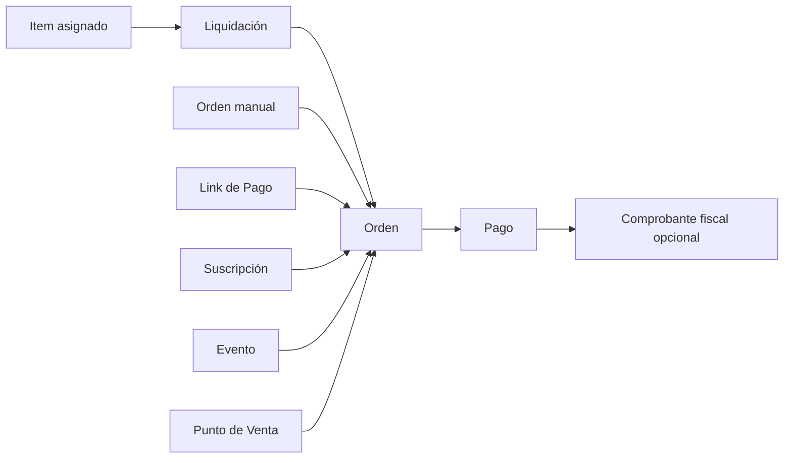

Una **orden** registra un importe que un cliente debe pagar. Puede nacer de una carga manual, una liquidación, un Link de Pago, una suscripción o un evento.

Una orden no es un comprobante fiscal de ARCA. El **pago** registra el cobro y, si tu organización usa facturación electrónica, el comprobante fiscal se gestiona después desde [Facturación](/docs/guides/facturacion).

<Info>
  Esta sección describe la vista **Administrador**. Crear, importar, exportar, corregir, enviar y cancelar son acciones administrativas.

  Otros roles pueden acceder a detalles limitados a su operación, pero no disponen de todos estos recorridos.
</Info>

<Info>
  **Liquidaciones** aparece si la organización tiene habilitadas las cuotas institucionales y la cuenta tiene acceso. En cuentas configuradas solo para Eventos, el módulo Órdenes puede estar oculto.
</Info>

## Elegí qué necesitás hacer

<CardGroup cols={2}>
  <Card title="Consultar órdenes" icon="magnifying-glass" href="/docs/guides/ordenes-gestionar">
    Buscá una deuda, interpretá su estado y revisá items, pagos, vencimiento y mora.
  </Card>
  <Card title="Crear una orden manual" icon="pen" href="/docs/guides/ordenes-crear-manual">
    Registrá un cobro puntual con un monto o con items disponibles.
  </Card>
  <Card title="Liquidar un período" icon="layer-group" href="/docs/guides/liquidaciones-crear-revisar">
    Generá órdenes en lote desde los items de Liquidación asignados a clientes activos.
  </Card>
  <Card title="Corregir, enviar o cancelar" icon="paper-plane" href="/docs/guides/liquidaciones-corregir-enviar-cancelar">
    Revisá una liquidación pendiente y decidí cómo continuar.
  </Card>
</CardGroup>

## Flujo simplificado

Los [items de Liquidación](/docs/guides/items-liquidaciones) definen qué cobrar, desde qué período y a qué clientes. Los [descuentos](/docs/guides/descuentos) reducen esos importes cuando se cumplen sus condiciones.

## Dos usos de la palabra Liquidación

En la creación manual, **Liquidación** es el tipo que permite elegir items de ese canal para una sola orden.

En la pestaña **Liquidaciones**, una liquidación es un proceso por período que prepara órdenes para varios clientes.

## De dónde puede venir una orden

<CardGroup cols={3}>
  <Card title="Manual" icon="pen">
    La crea un administrador desde la pestaña Órdenes.
  </Card>
  <Card title="Liquidación" icon="layer-group">
    Se prepara junto con otras órdenes para un período.
  </Card>
  <Card title="Link de Pago" icon="link" href="/docs/guides/links-pago">
    Se genera a partir de una compra en una página pública.
  </Card>
  <Card title="Suscripción" icon="repeat" href="/docs/guides/suscripciones">
    Se genera dentro de un cobro recurrente.
  </Card>
  <Card title="Evento" icon="calendar" href="/docs/guides/eventos">
    Se relaciona con la compra de entradas.
  </Card>
  <Card title="Punto de Venta" icon="cash-register" href="/docs/guides/punto-de-venta">
    Se relaciona con una venta presencial.
  </Card>
</CardGroup>

## Antes de liquidar

Completá estas tareas antes de crear una liquidación:

- Creá los [items de Liquidación](/docs/guides/items-liquidaciones).
- Definí su vigencia y mantenelos activos.
- Asignalos a los clientes correspondientes.
- Revisá los [descuentos](/docs/guides/descuentos) aplicables.
- Confirmá que los clientes que deban recibir una orden estén activos.

<Info>
  Una liquidación incluye clientes activos con items aplicables al período. Un cliente sin items aplicables no genera una orden.
</Info>

## Próximos pasos

<CardGroup cols={3}>
  <Card title="Gestionar órdenes" icon="list" href="/docs/guides/ordenes-gestionar">
    Empezá por el listado y el detalle de una orden.
  </Card>
  <Card title="Items y descuentos" icon="tags" href="/docs/guides/items-descuentos">
    Prepará los conceptos antes de una liquidación.
  </Card>
  <Card title="Pagos" icon="credit-card" href="/docs/guides/pagos">
    Consultá o registrá los cobros asociados.
  </Card>
</CardGroup>
