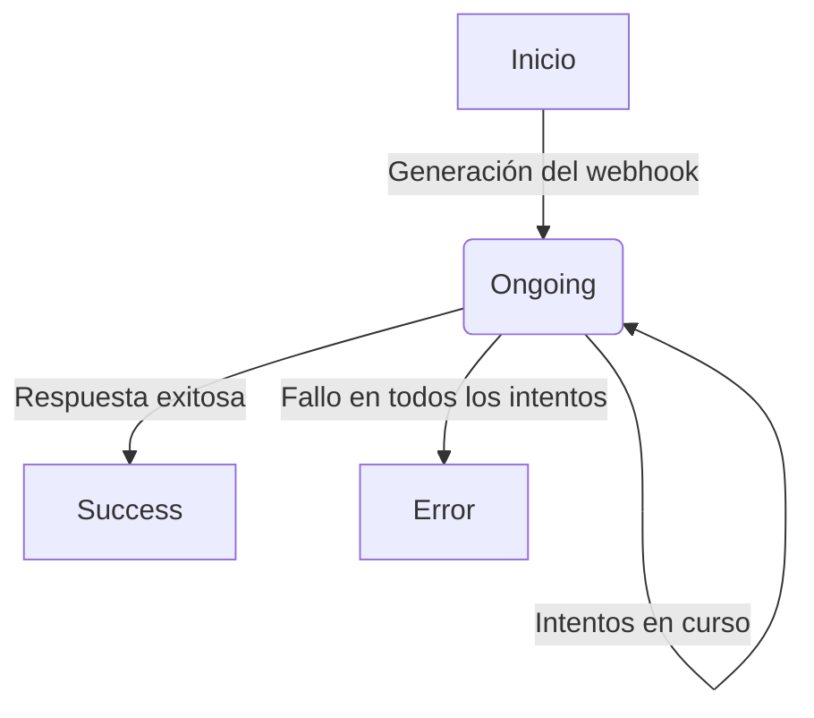

## Política de reintentos

Si Fint no recibe una respuesta con código 2xx de tu servidor, implementamos una política de reintentos escalonada:

1. **Intentos iniciales**: 5 intentos con intervalos de 5 minutos entre cada uno.
2. **Intentos adicionales**: 2 intentos más, uno cada día, si los intentos iniciales fallan.

Aquí tienes un ejemplo detallado de cómo funciona este proceso:

| Intento | Tiempo después del evento original |
|---------|-------------------------------------|
| 1       | Inmediatamente                      |
| 2       | 5 minutos                           |
| 3       | 10 minutos                          |
| 4       | 15 minutos                          |
| 5       | 20 minutos                          |
| 6       | 1 día                               |
| 7       | 2 días                              |

<Callout type="warning">
  Es importante que tu servidor esté preparado para manejar posibles duplicados, ya que podrías recibir el mismo evento más de una vez en caso de problemas de red o demoras en la respuesta.
</Callout>

## Sistema de Logs y Seguimiento

Cuando se envía un webhook, Fint genera automáticamente un log en nuestro sistema. Este log sirve como registro del envío del webhook y nos permite realizar un seguimiento detallado de cada intento de entrega.

### Características del Sistema de Logs

1. **Registro de intentos**: Cada intento de envío del webhook se registra en el log, incluyendo la hora del intento y el resultado.

2. **Estado del log**: El log tiene un estado que refleja el estado actual del webhook:
   - `ongoing`: El proceso de entrega está en curso.
   - `error`: Todos los intentos de entrega han fallado.
   - `success`: El webhook se ha entregado exitosamente.

3. **Actualización dinámica**: El estado del log se actualiza automáticamente según la política de reintentos y las respuestas del servidor destino.

4. **Trazabilidad**: Este sistema permite una trazabilidad completa del ciclo de vida de cada webhook, desde su generación hasta su entrega exitosa o fallo final.

### Cambios de Estado

<Callout type="info">
  El sistema de logs proporciona una herramienta valiosa para el monitoreo y la resolución de problemas relacionados con la entrega de webhooks.
</Callout>

## API de Webhooks Logs

Para acceder y gestionar los logs de webhooks programáticamente, puedes utilizar nuestra API de Webhooks Logs. Esta API te permite obtener información detallada sobre los intentos de entrega, estados y otros datos relevantes de cada webhook enviado a tu servidor.

<Card title="Documentación de API de Webhooks Logs" icon="code" href="/api-reference/webhook/obtener-lista-de-registros-de-webhook" />

## Recomendaciones

Para probar el endpoint desde tu aplicación local, te recomendamos usar [ngrok](https://ngrok.com/). Esta herramienta proporciona una URL HTTPS que crea un túnel a tu aplicación local, facilitando las pruebas.

Si aún no tienes un servidor para probar los webhooks, te sugerimos utilizar [webhook.site](https://webhook.site/). Este sitio web te proporciona un endpoint HTTPS que puedes usar para realizar pruebas de webhooks de manera sencilla.

